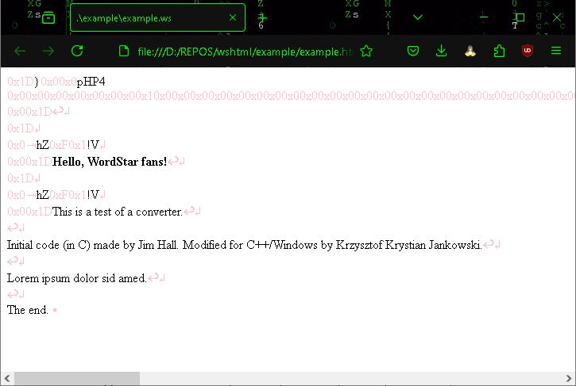

# Converting WordStar files

This is a program to convert WordStar documents to HTML.

WordStar was a popular desktop word processor from the 1980s. It
was originally published by MicroPro for the CP/M operating
system, and later for MS-DOS where it gained the height of its
popularity during the early 1980s.

## Formatting codes

WordStar used control codes for inline formatting such as bold
and underlined text, and dot commands for other formatting such
as margins and offsets.

The dot commands aren’t too far from nroff, the standard Unix
document preparation system, although the WordStar commands
are unrelated to each other. For example, while WordStar and
nroff share a similar dot command to set the page length (`.PL`
on WordStar, `.pl` on nroff) WordStar has unique dot commands
to set features like the character width (`.CW`) or the footing
(`.FO`) or the line height (`.LH`).

Inside the file, WordStar used single-byte 7-bit ASCII characters
for printable characters. For example, the letter "capital
A" (`A`) has the ASCII value of 65, or binary value **0100 0001**,
or hexadecimal 0x41.

## Character encoding

WordStar used ASCII values below ASCII 0x20 (space) as control
codes. To turn bold type on or off, WordStar inserted ASCII
0x02. Similarly, WordStar used ASCII 0x13 to turn underline on
or off, and ASCII 0x19 to set and unset italic text. WordStar
also supported other control codes for strikethrough, double
strike, superscript, subscript, and other formatting.

White space characters were as you might expect: a space was a
space, and a tab was a tab. Each line ended with the carriage
return and new line pair (ASCII values 0x0d and 0x0a) which was
the standard character pair for the DOS operating system. ASCII
0x1a marked the end of the file.

While WordStar used 7-bit ASCII characters for printable data,
it reserved bit 8 (the "high bit") to indicate characters
that can be "microjustified" by the printer driver, such as
to create adjusted paragraphs that go all the way to the right
margin. To retrieve the printable value, the print driver would
strip off the high bit. This feature was used through WordStar
4, but removed from later versions of WordStar, relying instead
on the dot commands to control text justification.

## Convert to HTML

We can use this to examine a sample WordStar file, and convert
it to HTML output.

While this program converts the inline formatting via the control
codes, it does not recognize the dot commands as anything other
than normal text; any dot commands will be included verbatim
in the output, just like body text. If you are interested in
converting files that also use dot commands for document-level
formatting, you can use this program as a starting point.

----

This Readme is adapted from
[Converting WordStar files](https://www.both.org/?p=6898)
by Jim Hall, and is distributed under the
Creative Commons Attribution ShareAlike license.

----

## This Fork
My changes and instructions.

### Usage
Run on Windows 10 in PowerShell

```.\WSHTML.EXE .\example\example.ws > .\example\example.html```

### Example


